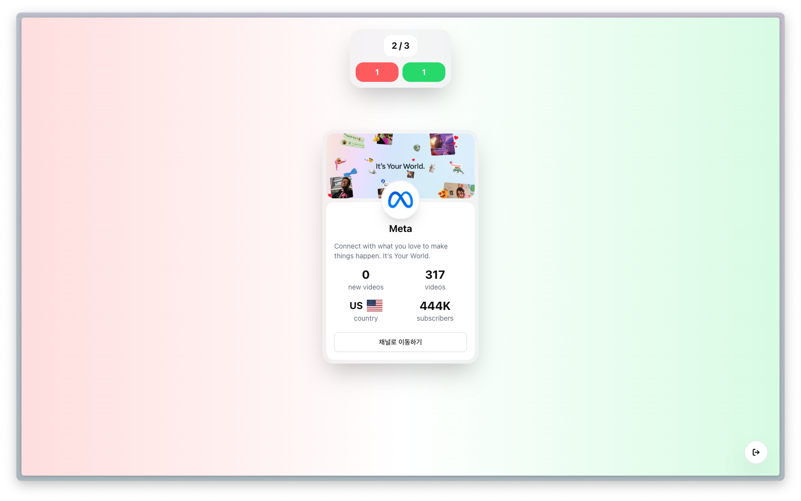

# declutter

## 설명

유튜브 구독 채널을 좌우 스와이프 인터랙션으로 빠르게 확인하고 정리할 수 있는 애플리케이션입니다.

## 기술 스택

- Next.js 16 (App Router)
- Tailwind CSS 4, motion
- next-auth (v5)
- @tanstack/react-query, ky

## 기능

- [x] 구글 로그인을 통해 유튜브 구독 리스트 조회, 삭제 (Google OAuth 심사 예정)
- [x] 카드 스와이프 인터렉션
- [ ] 모바일 해상도 대응
- [ ] SEO

## 라이센스

- [MIT](./LICENSE)
